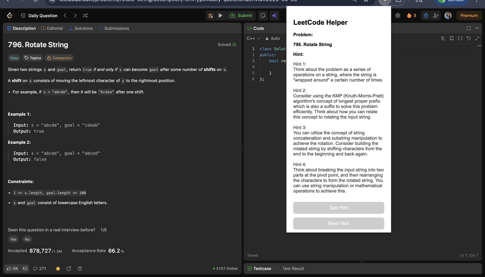

# LeetCode AI Helper Chrome Extension

An AI-powered Chrome extension that provides progressive hints and interactive guidance while solving LeetCode problems.

## 🚀 Features

- Multi-level hint system (up to 4 progressive hints)
- Controlled hint flow (level 1 → level 4)
- Show all hints functionality
- Interactive chat assistant
- Clean and minimal UI
- Works directly on LeetCode

## 📸 Demo

### 🔹 Extension on Launch (Problem Loaded Automatically)
Shows how the extension looks when opened the problem title is detected instantly from LeetCode.

### 🔹 Hint + Chat in Action
Displays the extension after generating hints and asking a question using the chat feature.

### 🔹 All Hints View (Level 1 → Level 4)
Shows all 4 progressive hints displayed together after reaching the final hint level.

## 🧠 Hint System Design

The extension provides **maximum 4 hints**, each designed to gradually guide the user:

- **Level 1:** Very basic clue  
- **Level 2:** Direction towards approach  
- **Level 3:** Mentions technique or pattern  
- **Level 4:** Strong guidance (near solution, but not complete answer)  

This ensures users learn step-by-step instead of directly seeing solutions.

## 🧠 Tech Stack

- JavaScript  
- Chrome Extension APIs  
- Groq API (LLM)

## ⚙️ How It Works

1. Extracts problem title from LeetCode page  
2. Sends it to an AI model  
3. Returns structured hints or answers  
4. Displays them inside the extension UI  

## 🔒 Note

API key is not included for security reasons.

## 📌 Future Improvements

- Problem type detection  
- Adaptive hint system  
- User progress tracking  
