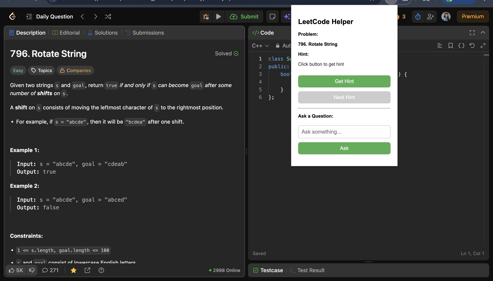
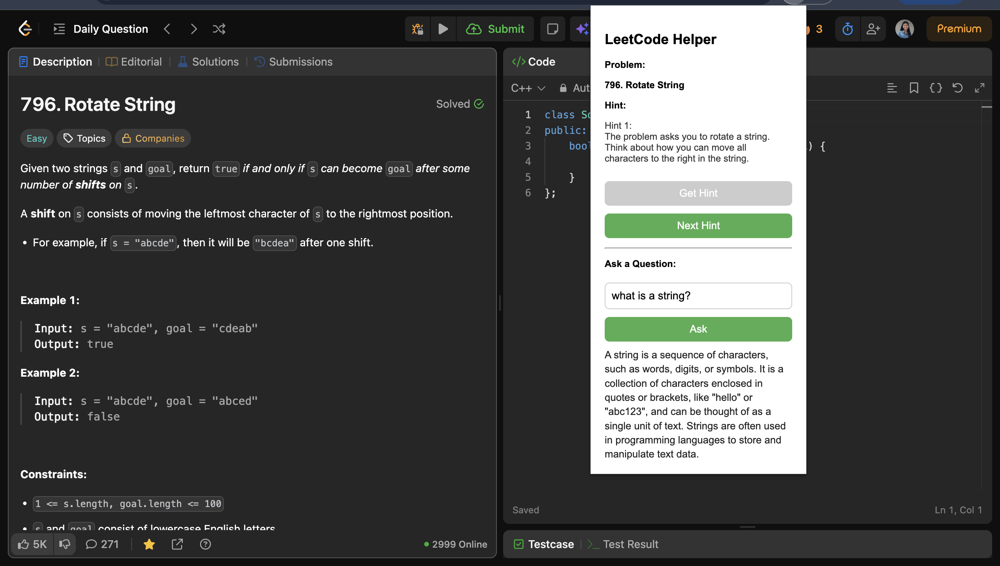

# LeetCode AI Helper Chrome Extension

An AI-powered Chrome extension that provides progressive hints and interactive guidance while solving LeetCode problems.

## 🚀 Features

- Multi-level hint system (step-by-step guidance)
- Interactive chat assistant
- Show all hints functionality
- Clean and minimal UI
- Works directly on LeetCode

## 📸 Demo

### 🔹 Extension on Launch (Problem Loaded Automatically)
Shows how the extension looks when opened — the problem title is detected instantly from LeetCode.

### 🔹 Hint + Chat in Action
Displays the extension after generating hints and asking a question using the chat feature.

## 🧠 Tech Stack

- JavaScript  
- Chrome Extension APIs  
- Groq API (LLM)

## ⚙️ How It Works

1. Extracts problem title from LeetCode page  
2. Sends it to an AI model  
3. Returns structured hints or answers  
4. Displays them inside the extension UI  

## 🔒 Note

API key is not included for security reasons.

## 📌 Future Improvements

- Problem type detection  
- Adaptive hint system  
- User progress tracking   
